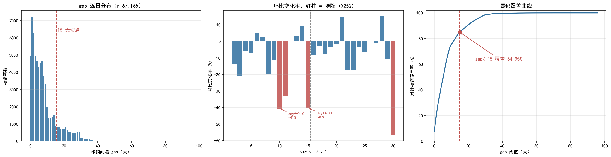
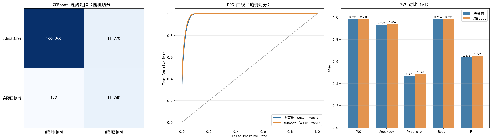
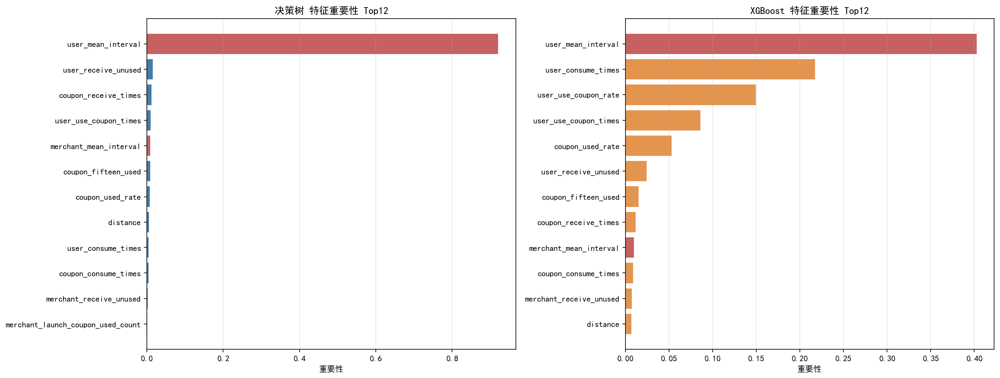
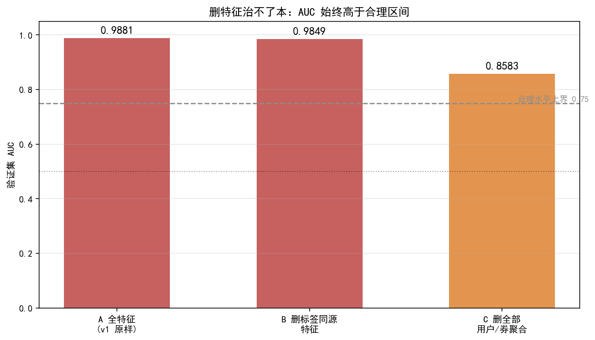
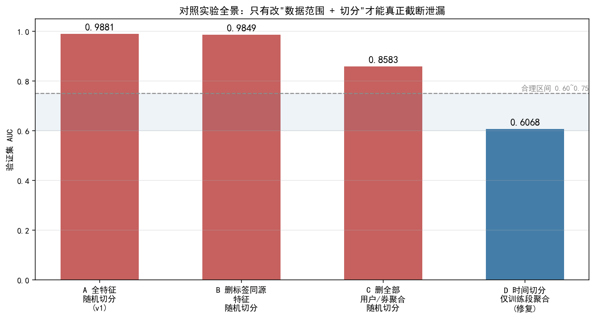
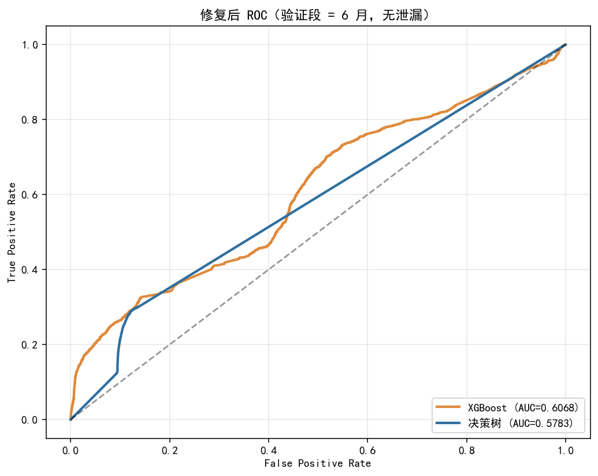
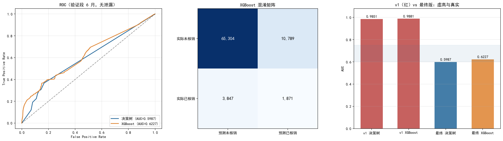
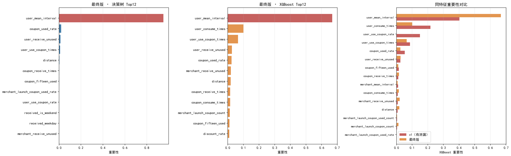

# O2O 优惠券个性化投放（Coupon Personalized Delivery）

> 预测用户**领券后 15 天内是否会到店核销**，用于优惠券的精准定向投放，提升核销率与投放 ROI。
>
> 本项目按**十一个步骤**组织，完整走通一条
> **「先做出高指标 → 发现指标是假的 → 定位泄漏 → 修复 → 在干净框架下重做 → 换目标重估」**的实践主线。
> 最有价值的不是最终的 AUC 数字，而是这次「高指标先怀疑泄漏」的完整诊断过程——
> 以及最后发现**真正该优化的是核销总量，而不是排序**。
>
> **核心交付物**：7 月核销总量预测 —— **6,858 张**（区间约 4,946 ~ 7,486）+ 100,669 行逐行预测表。

---

## 目录

- [1. 项目概述](#1-项目概述)
- [2. 目录结构](#2-目录结构)
- [3. 业务背景与问题定义](#3-业务背景与问题定义)
- [4. 数据集](#4-数据集)
- [5. 全流程导航](#5-全流程导航)
- [6. 十步详解](#6-十步详解)
  - [01 数据预处理](#01-数据预处理) ｜ [02 数据探索 EDA](#02-数据探索eda) ｜ [03 特征工程 v1](#03-特征工程-v1) ｜ [04 模型结果 v1](#04-模型结果-v1) ｜ [05 特征排名 v1](#05-特征排名-v1)
  - [06 发现数据泄漏](#06-发现数据泄漏) ｜ [07 解决数据泄漏](#07-解决数据泄漏) ｜ [08 最终特征工程](#08-最终特征工程) ｜ [09 最终模型结果](#09-最终模型结果) ｜ [10 最终特征排名](#10-最终特征排名)
  - [11 核销总量预测](#11-核销总量预测) ⭐ **目标切换：从「排序」到「总量」**
- [7. 方法论总结](#7-方法论总结)
- [8. 复现说明](#8-复现说明)
- [9. 结论与展望](#9-结论与展望)

---

## 1. 项目概述

- **任务类型**：二分类预测（O2O 优惠券核销预测）
- **预测目标**：`P(核销 | 用户, 商户, 优惠券, 领券时间)`
- **业务价值**：把「无差别群发优惠券」变为「给高意向用户发券」，提升核销率、降低投放成本
- **技术栈**：Python · Pandas / NumPy · scikit-learn（决策树） · XGBoost · Matplotlib
- **关键成果 1**：定位并修复了导致 AUC 虚高（**0.988**）的三类数据泄漏，重建为时间切分的无泄漏评估（真实 AUC **约 0.62**）
- **关键成果 2**：切换目标到「核销总量」后，发现 19 特征模型误差 **+210%**；改用 `distance` 单变量曲线把跨段误差降到 **12.97%**，交付 **7 月预测总量 6,858 张**

---

## 2. 目录结构

```
O2O-Coupon-Personalization/
├── README.md                     # 本项目全案文档（十步主线）
├── requirements.txt              # 依赖清单
├── notebooks/                    # ★ 主线：十步流程（已含完整输出，GitHub 可直接渲染）
│   ├── 01_数据预处理.ipynb
│   ├── 02_数据探索EDA.ipynb
│   ├── 03_特征工程_v1.ipynb
│   ├── 04_模型结果_v1.ipynb
│   ├── 05_特征排名_v1.ipynb
│   ├── 06_发现数据泄漏.ipynb
│   ├── 07_解决数据泄漏.ipynb
│   ├── 08_最终特征工程.ipynb
│   ├── 09_最终模型结果.ipynb
│   ├── 10_最终特征排名.ipynb
│   ├── 11_核销总量预测.ipynb      # ★ 交付物所在：7 月逐行预测 + 核销总量
│   └── _src/                     # notebook 的源码形态（.py，便于 diff 与维护）
├── data/                         # 原始数据（不入库，见第 8 节）
├── data_out/                     # 各步骤的中间产物（不入库）
├── results/
│   ├── figures/                  # 全部图表
│   └── tables/                   # 全部结论表（README 引用的数字均出自此处）
└── legacy/                       # 重构前的旧版代码归档（仅供追溯，见 legacy/README.md）
```

> **`notebooks/_src/*.py` 是什么**：每个 notebook 的可维护源码形态（jupytext 风格的分隔标记）。
> 改动请改 `_src/`，再生成 `.ipynb`——这样代码在 git 里是**可读的文本 diff**，而不是一大坨 JSON。

---

## 3. 业务背景与问题定义

O2O 平台为刺激消费发放大量优惠券，但大部分券被领取后闲置，**核销率极低、投放成本浪费**。本项目的目标是：对每张已领取的优惠券，预测该用户**领券后 15 天内是否到店核销**，从而指导「给谁发、发什么券」。

### 正负样本定义

```
gap   = (date - date_received).days     # 核销间隔天数（未核销为 NaN）
class = 1  if  gap <= 15                # 领券后 15 天内到店核销（有效转化）
class = 0  其他                         # 未核销 或 15 天后才核销
样本  = 仅 coupon_id 非空的行            # 未领券记录不构成样本
```

### 为什么是 15 天：三层论证

> ⚠️ 这一点很容易被写成「数据里发现 15 天是个边界」——**那是个方向性错误**，下面给出正确的三层论证。

15 天是**业务约定，不是数据边界**。论证分三层，**主位是业务，数据只做确认**：

| 层次 | 内容 | 证据类型 | 强度 |
|---|---|---|---|
| **① 主位** | 两周是公认的转化黄金窗口；与天池赛题官方口径（15 天内核销）一致 | 业务约定（规范性） | — |
| **② 确认** | gap 分布在 15 天附近平滑连续、无反常结构（day15 = 896 → day16 = 824） | 未被数据违背 | 弱 |
| **③ 确认** | `gap<=15` 覆盖 **57,060 / 67,165 = 84.95%** 的核销，不丢主要转化 | 覆盖率 | **强** |

**为什么②只能算「弱」确认——因为它恰恰证明不了 15 天**：实测最陡的两个断层在 **day9→10（−40.8%）** 和 **day14→15（−40.4%）**，而 day15→16 只有 **−8.0%**。也就是说，如果指望从数据里「看出」一个边界，那么数据给出的答案是 **9→10 那个断层**，而不是 15。分布是「长尾 + 7 天周期」（day7 / 14 / 21 / 28 是局部峰），**15 这个点在数据上毫无特殊结构**。

> 结论：**15 天只能靠业务论证**，数据能做的是「不反对」它（②）和「证明它不丢主要转化」（③）。
> 把平滑当作「支持 15 天的证据」是方向性错误——平滑说明的是**数据不支持任何一个特殊切点**。

> 📌 补充澄清：分布中**并不存在「第 15 天之后券失效」的业务断层**——第 16 天起仍有 10,105 笔核销（占 15.05%），gap 最远延伸到 96 天。

### 为什么不是「核销即正」

标签不直接定义为「领券后是否核销」，而是加了 15 天时效窗口，理由有三：

1. **原始数据没有券有效期字段**——7 列不含任何「过期日」，因此「第 16 天仍有核销」只能说明券在数据集里未被设过期，测不出券的真实生命周期；「15 天」本就不是对券有效期的刻画。
2. **「券能核销」≠「算有效转化」**——gap>15 的核销确实发生、券确实起了作用（物理事实），但投放是当期决策：让利成本当月付出，消费却发生在活动周期之外，对「这期该不该给他发券」没有指导意义。负样本否定的是「对当期投放的决策价值」，不是「券是否起作用」。
3. **反馈闭环的可操作性**——若按「核销即正」，gap 最长 96 天，5 月领券的样本要到 8 月才能确定标签，训练与投放的反馈周期被拉到 3 个月，不可操作；15 天窗口让标签两周内即可确定。

一句话：**标签是投放决策的判据（多久算「及时」），不是对券是否起作用的裁决。**

---

## 4. 数据集

数据来自天池 O2O 优惠券赛题（2016 年 O2O 优惠券使用预测）。

| 项 | 值 |
|---|---|
| 训练集 | 1,648,881 行 × 7 列 |
| 测试集 | 100,669 行 × 6 列（无 `date` 列） |
| 正样本率 | **6.02%**（严重类别不平衡，不平衡比 1 : 15.6） |
| 时间范围 | 领券 2016-01 ~ 2016-06（训练）/ 2016-07（测试） |

| 字段 | 含义 | 建模角色 |
|---|---|---|
| `user_id` | 用户 ID | 分组键 |
| `merchant_id` | 商户 ID | 分组键 |
| `coupon_id` | 优惠券 ID | 分组键 |
| `discount_rate` | 折扣率（`0.8` 或 `150:20` 满减） | 特征 |
| `distance` | 用户到商户距离 | 特征 |
| `date_received` | 领券日期 | 时间 / 标签来源 |
| `date` | 到店消费日期（空 = 未核销） | 标签来源 |

---

## 5. 全流程导航

十步的主线是一条**闭环**：前五步「正常」做项目，得到漂亮指标；后五步回过头把它推翻重做。
第 11 步是**追加的交付环节**：把目标从「排序」切换到「总量」，并揭示前十步的优化方向与真实需求并不一致。

```
01 数据预处理 ─→ 02 数据探索 EDA ─→ 03 特征工程 v1 ─→ 04 模型结果 v1 ─→ 05 特征排名 v1
                                                                              │
                                                                              ▼
                                                                  06 发现数据泄漏 ← 指标反常
                                                                              │
                                                                              ▼
                                                                  07 解决数据泄漏（改范围 + 改切分）
                                                                              │
                                                                              ▼
                                        08 最终特征工程 ─→ 09 最终模型结果 ─→ 10 最终特征排名
                                                                              │
                                                                              ▼
                                                                  11 核销总量预测 ★ 交付物
```

| # | 步骤 | 一句话 | 关键产出 |
|---|---|---|---|
| 01 | 数据预处理 | 清洗 + 统一口径 + 构建标签 + 时间切分 | `clean_train/test.csv` |
| 02 | 数据探索 EDA | 看清 gap 分布、缺失结构、类别不平衡 | 15 天的三层论证 |
| 03 | 特征工程 v1 | 多粒度聚合（用户/商户/券画像）**15 个特征** | 埋下了泄漏 |
| 04 | 模型结果 v1 | 决策树 / XGBoost，**AUC 0.985 / 0.988** | ⚠️ 虚高 |
| 05 | 特征排名 v1 | Top1 是 `user_mean_interval`，占比 **40.3%**，CR3 **76.9%** | 权重异常集中 |
| 06 | 发现数据泄漏 | 相关性 + 消融实验，定位**三类泄漏** | 删特征治不了本 |
| 07 | 解决数据泄漏 | 时间切分 + 仅训练段聚合 → AUC 落到 **0.607** | 泄漏被截断 |
| 08 | 最终特征工程 | 在无泄漏框架下再修 3 个问题，**19 个特征** | 最终特征集 |
| 09 | 最终模型结果 | 干净框架下重搜超参 → **AUC 0.62** | 可信指标 |
| 10 | 最终特征排名 | 集中度不降反升 → 暴露「内置重要性有偏」 | 修复判据的修正 |
| 11 | 核销总量预测 | 换目标后 19 特征模型失效，**只用 `distance` 反而最准** | **7 月预测总量 + 逐行 label** |

---

## 6. 步骤详解

> 01–10 是在「排序」目标下的一条完整闭环：从清洗一路走到特征排名，每一步都修正上一步暴露的偏差。
> 11 是追加的交付环节——**换了目标之后，前十步的结论被推翻了一半**，详见 [11 核销总量预测](#11-核销总量预测)。

### 01 数据预处理

完整实现见 [`notebooks/01_数据预处理.ipynb`](notebooks/01_数据预处理.ipynb)。

要点：

1. **合并 train/test 统一清洗**：`'null'` 字符串 → `NaN` / `None`
2. **日期解析**：数值浮点 `20160528.0` → `datetime`
3. **折扣率统一**：满减 `'150:20'` → 折扣率 `0.87`（`(150-20)/150`）
4. **时间切分**：领券月 ≠ 7 为训练池，== 7 为测试集
5. **标签构建**：`gap <= 15` → `class=1`；过滤 `coupon_id` 为空的行
6. **再切分验证段**：训练池按领券月切为 1-5 月（训练）/ 6 月（验证），模拟「用历史预测未来」

**缺失结构——缺失即业务，不是脏数据**：

| 字段 | 缺失数 | 缺失率 | 业务含义 | 处理方式 |
|---|---|---|---|---|
| `coupon_id` | 701,602 | 42.55% | **未领券**记录（用户直接到店消费） | 不进样本，但参与历史行为统计 |
| `date` | 880,114 | 53.38% | **未核销**记录（领券后未使用） | 标签来源，不可填 |

**样本划分结果**：

| 集合 | 行数 | 正样本率 |
|---|---|---|
| 训练段（1-5 月） | 865,468 | 5.9% |
| 验证段（6 月） | 81,811 | 7.0% |
| 测试段（7 月） | 100,669 | — |

---

### 02 数据探索 EDA

完整实现见 [`notebooks/02_数据探索EDA.ipynb`](notebooks/02_数据探索EDA.ipynb)。



**记录类型分布**（标签映射的依据）：

| 记录类型 | `coupon_id` | `date` | `class` | 数量 | 占比 |
|---|---|---|---|---|---|
| 未领券（仅消费） | 空 | 有值 | —（不进样本） | 701,602 | 42.55% |
| 领券未核销 | 有值 | 空 | 0 | 880,114 | 53.38% |
| 领券 · 15 天内核销 | 有值 | 有值 | **1** | 57,060 | 3.46% |
| 领券 · 15 天后核销 | 有值 | 有值 | 0 | 10,105 | 0.61% |

> 📌 口径说明：核销总数 = 57,060 + 10,105 = **67,165**（占全量 4.07%）。
> 上表是**全量 164.9 万行**的四分类拆分；而 `gap<=15` 覆盖率 84.95% 的分母用的是其中「已核销」的 67,165 笔。

**七条关键洞察**：

| # | 洞察 | 对建模的影响 |
|---|---|---|
| 1 | gap 分布为长尾 + 7 天周期（day7/14/21/28 是峰），15 天无特殊结构 | 15 天只能作业务约定，不能包装成数据边界 |
| 2 | 最陡断层在 day9→10（−41%）与 day14→15（−40%），day15→16 仅 −8% | 切点靠业务论证，数据只做确认 |
| 3 | `gap<=15` 覆盖 **84.95%** 的核销 | 15 天不丢主要转化（最强数据证据） |
| 4 | 正样本仅 6.02%，不平衡比 1 : 15.6 | 必须用 AUC 评估 + 类别权重 |
| 5 | `coupon_id` 缺失 42.55%、`date` 缺失 53.38%，缺失即业务行为 | 不能删不能填，按语义分别处理 |
| 6 | 距离越近核销率越高；折扣率与核销率有区分度 | `distance` / `discount_rate` 应保留 |
| 7 | 领券集中 1、5 月，6 月下滑；test 为 7 月 | 时间切分（历史预测未来）业务上成立 |

**结论**：`distance` 和 `discount_rate` 有区分度，必须进模型——**这条洞察后来在第 08 节起了一次关键作用**（v1 竟然把 `discount_rate` 写进了排除列表）。

---

### 03 特征工程 v1

完整实现见 [`notebooks/03_特征工程_v1.ipynb`](notebooks/03_特征工程_v1.ipynb)。

**总体思想：多粒度聚合。** 原始数据是**事件粒度**（一行 = 一次领券事件）。预测核销与否，单看这一行信息太薄，**核销主要由「主体是谁」决定**。因此把事件行展开为三份主体画像：

```
事件行 = 用户画像 + 商户画像 + 券画像 + 事件属性(距离)
            │           │          │
        按user_id   按merchant_id  按coupon_id
        分组聚合      分组聚合       分组聚合
```

v1 得到 **15 个特征**：

| 粒度 | 特征 | 业务假设 |
|---|---|---|
| 事件 | `distance` | 便利度 |
| 用户 | `user_use_coupon_times` / `user_consume_times` | 用券 / 消费活跃度 |
| 用户 | `user_use_coupon_rate` | 券敏感度（归一化剔活跃度） |
| 用户 | `user_receive_unused` | 领了不用 → 大概率再浪费 |
| 用户 | `user_mean_interval` | ⚠️ 历史核销间隔均值 —— **泄漏元凶** |
| 商户 | `merchant_launch_coupon_used_count` / `_rate` | 商户券转化能力 |
| 商户 | `merchant_launch_coupon_count` | 发券活跃度 |
| 商户 | `merchant_receive_unused` | 商户券浪费情况 |
| 商户 | `merchant_mean_interval` | ⚠️ 商户券核销间隔均值 —— **泄漏** |
| 券 | `coupon_receive_times` / `coupon_consume_times` | 券受欢迎度 / 历史核销量 |
| 券 | `coupon_fifteen_used` | ⚠️ 券 15 天内核销数 —— **标签聚合** |
| 券 | `coupon_used_rate` | ⚠️ 退化：只有 0/1 两值 |

> **⚠️ 三处已经埋下的雷（当时完全没意识到）**：
> 1. `user_mean_interval` 是 `gap` 的均值，而标签就是 `gap <= 15` —— **目标泄漏**
> 2. 聚合在**全量数据**上 groupby —— 自身行与未来信息混入 —— **自指泄漏**
> 3. `coupon_used_rate` 分子分母取自**同一个 `gap<=15` 子集**，比率恒为 1，退化成二值指示器
>
> 第 3 条是**实跑发现**的：v1 声称它「恒等于 1」，但按**券级口径**（9,363 张券各取一行）
> 实测只有 **61.7%** 的券该值为 1、**38.3%** 为 0——因为对没有 15 天内核销的券，
> 对齐后分子为空被填 0。它实际等价于 `coupon_fifteen_used > 0`，是个二值指示器而非比率。

前两点是**泄漏**，在第 06 节被引爆；第 3 点是**实现缺陷**（不涉及泄漏），在第 08 节修复。

---

### 04 模型结果 v1

完整实现见 [`notebooks/04_模型结果_v1.ipynb`](notebooks/04_模型结果_v1.ipynb)。

| 模型 | 参数 |
|---|---|
| **决策树** | `max_depth=15`, `min_samples_leaf=100`, `min_samples_split=50`, `class_weight='balanced'` |
| **XGBoost** | `learning_rate=0.1`, `max_depth=6`, `n_estimators=200`, `scale_pos_weight ≈ 15.9` |

**结果（⚠️ 数据泄漏，数字不可信）**：

| 指标 | 决策树 | XGBoost |
|---|---|---|
| **AUC** | 0.9851 | **0.9881** |
| Accuracy | 0.9321 | 0.9359 |
| Precision | 0.4697 | 0.4841 |
| Recall | 0.9844 | 0.9849 |
| F1 | 0.6359 | 0.6491 |



**随机切分下的重叠证据**（`test_size=0.2, random_state=42, stratify=y`）：

| 实体 | 训练侧总数 | 验证侧总数 | 横跨两侧 | 占训练侧 |
|---|---|---|---|---|
| 用户 | 399,696 | 149,109 | 92,864 | 23.2% |
| 商户 | 5,273 | 4,116 | 4,026 | **76.4%** |
| 券 | 9,191 | 7,030 | 6,858 | **74.6%** |

> 商户那一行尤其刺眼：**训练侧 5,273 个商户里有 4,026 个（76.4%）**同时出现在验证侧。
> 这意味着验证集样本的商户画像，是从「已经知道这些商户的券核销情况」的统计里算出来的——
> 模型在验证集上评估的，其实是**它已经见过的商户**。

---

### 05 特征排名 v1

完整实现见 [`notebooks/05_特征排名_v1.ipynb`](notebooks/05_特征排名_v1.ipynb)。



| 排名 | 特征 | 决策树 | XGBoost |
|---|---|---|---|
| **1** | `user_mean_interval` | **0.9207** | **0.4026** |
| 2 | `user_consume_times` | 0.0041 | 0.2172 |
| 3 | `user_use_coupon_rate` | 0.0 | 0.1496 |
| 4 | `user_use_coupon_times` | 0.0101 | 0.0861 |
| 5 | `coupon_used_rate` | 0.0078 | 0.0528 |

**权重集中度**：

| 指标 | 值 |
|---|---|
| Top1 占比 | **40.3%** |
| CR3 占比 | **76.9%** |

> **这就是最响的警报**：15 个特征里，单独一个就吃掉了 XGBoost **40.3%** 的权重；
> 决策树上它更是独占 **0.9207**——剩下的 14 个特征加起来只有 0.08。
>
> 一个模型如果把 92% 的注意力放在单一特征上，只有两种可能：
> **要么这个特征真的压倒性地强，要么它在偷看答案。**
> 结合 AUC 0.988 一起看，只能是后者。

---

### 06 发现数据泄漏

完整实现见 [`notebooks/06_发现数据泄漏.ipynb`](notebooks/06_发现数据泄漏.ipynb)。

**现象**：v1 报告 AUC 0.985 / 0.988。**高得反常**——正样本率仅 6% 的任务，
领域常识约 0.7 左右（天池同题赛榜前约 0.68~0.75）。**第一反应不是庆祝，而是排查泄漏。**

**第一步：算特征与标签的相关性**

| 特征 | 与 `class` 相关系数 | 是否由标签量派生 |
|---|---|---|
| **`user_mean_interval`** | **−0.5610** | ✅ 是（`gap` 的均值） |
| `distance` | −0.1489 | 否 |
| `coupon_fifteen_used` | 0.1215 | ✅ 是（`gap<=15` 的计数） |
| `merchant_mean_interval` | −0.1004 | ✅ 是（`gap` 的均值） |
| `coupon_used_rate` | 0.0516 | ✅ 是（退化，二值指示器） |

一个特征与标签的相关系数达到 **−0.56**，而它用的原料 `gap` **正是标签的定义量**——
这不是「特征好用」，这是「**特征在复述答案**」。

**第二步：定位三类泄漏**

| 类型 | 机制 | v1 中的表现 |
|---|---|---|
| **① 目标泄漏** | 特征与标签由**同一个量**派生 | `user_mean_interval` = `mean(gap)`，而标签就是 `gap<=15`；相关系数 −0.56，重要性排名第 1 |
| **② 自指泄漏** | 聚合**含自身行**，且混入未来信息 | 聚合在全量数据 groupby：正样本被自己的核销结果抬高；1 月的记录里混入了该用户 2-6 月的未来消费 |
| **③ 重叠泄漏** | 随机切分导致**同一主体跨集共享** | `train_test_split` 随机切分，同一 user/merchant/coupon 同时进训练与验证，验证集「记住」了训练画像 |

> 三类里 **③ 最难察觉**——它不体现在任何单个特征上，只体现在**切分这个动作**里。
> 检查方法很朴素：切分后数一数有多少实体横跨了两侧。实测 **76.4% 的商户、74.6% 的券**
> 跨越了训练/验证边界（见 [04 节](#04-模型结果-v1)的重叠证据表）。

**第三步：消融实验（这是本节最关键的一步）**



| 实验 | AUC | 相对 v1 | 结论 |
|---|---|---|---|
| **A** 全特征 + 随机切分（v1 原样） | 0.9881 | — | 三类泄漏叠加，严重虚高 |
| **B** 只删 `mean_interval` 特征 | 0.9849 | −0.0032 | **几乎不掉** → 泄漏冗余分布，删特征无效 |
| **C** 删全部用户/券聚合特征 | 0.8583 | −0.1298 | 仍偏高 → 自指泄漏未除（聚合仍覆盖全量） |

> **B 的结果是本节最重要的发现**：把「元凶特征」直接删掉，AUC 只掉 0.003。
> 这证明泄漏**不是某一个特征的问题，而是机制性的**——泄漏冗余分布在多个聚合特征里，
> 模型删一个、从另一个补回来。
>
> **所以「删掉可疑特征」是错误的修复方向。** 必须正面回答：泄漏到底从哪进来？

---

### 07 解决数据泄漏

完整实现见 [`notebooks/07_解决数据泄漏.ipynb`](notebooks/07_解决数据泄漏.ipynb)。

**修复方向：不动特征，改数据的「范围」与「切分」。**

```
第 07 节的 D 组方案
─────────────────────────────────────────────
 训练段(1-5月) ──> 在这里算画像，也在这里训练
 验证段(6月)   ──> 只评估，特征全部来自训练段历史
 测试段(7月)   ──> 最终预测
 所有 groupby 只在训练段上执行
─────────────────────────────────────────────
```

两处改变，各对应一类泄漏：

| 改动 | 截断哪类泄漏 |
|---|---|
| **时间切分**（1-5 / 6 / 7 月，替代随机切分） | ③ 重叠泄漏 + ② 中的「未来信息」 |
| **聚合只在训练段执行**（替代全量 groupby） | ② 自指泄漏 |
| *（`mean_interval` 并未删除——方法修对了，它自己就不再泄漏）* | ① 目标泄漏随之消解 |

**修复效果**：



| 实验 | AUC | 相对 v1 |
|---|---|---|
| A 全特征 + 随机切分（v1 原样） | 0.9881 | — |
| B 只删 `mean_interval` 特征 | 0.9849 | −0.0032 |
| C 删全部用户/券聚合特征 | 0.8583 | −0.1298 |
| **D 时间切分 + 仅训练段聚合** | **0.6068** | **−0.3813** |

| 模型 | 无泄漏 AUC（验证段 6 月） |
|---|---|
| 决策树 | 0.5783 |
| **XGBoost** | **0.6068** |

> **0.9881 → 0.6068，落差 −0.38。** 这个落差不是「模型变差了」，
> 而是**指标终于说真话了**。

**代价：冷启动问题浮出水面**



聚合只在训练段算，意味着验证/测试段里**没见过的主体拿不到画像**：

| 集合 | 实体 | **按行（预测请求）** | **按唯一值（主体覆盖率）** | 该段唯一值数 |
|---|---|---|---|---|
| 验证段（6 月） | 用户 | 36.2% | 38.8% | 68,818 |
| 验证段（6 月） | 商户 | 2.7% | 11.2% | 2,543 |
| 验证段（6 月） | 券 | **68.8%** | **26.9%** | 3,142 |
| 测试段（7 月） | 用户 | 12.9% | 13.9% | 68,258 |
| 测试段（7 月） | 商户 | 1.9% | 14.2% | 1,483 |
| 测试段（7 月） | 券 | **88.7%** | **61.6%** | 1,965 |

**两种口径都要看，因为它们回答的是不同的问题**：

- **按行** = 有多大比例的**预测请求**落在一个全新主体上（投放视角）
- **按唯一值** = 有多大比例的**主体**是全新的（覆盖率视角）

> ⚠️ **一个我们踩过的坑**：这里最初是用「画像特征 `== 0`」当冷启动代理指标的
> （券冷启动因此被算成 91.3%）。它测的其实不是「训练段没见过这张券」，而是
> 「这张券在训练段没有 15 天内核销记录」——一张出现几百次、只是从未在 15 天内被核销的券，
> 值同样是 0；用户的 `user_mean_interval == 0` 也同理（当天领当天用的用户，均值本就是 0）。
> **代理指标必须回到定义去验证**，正确做法是直接做集合运算。

**测试段 88.7% 的预测请求落在没见过的券上**——O2O 场景里券 ID 时效性极强，
这个衰减是业务真实存在的，不是修复引入的缺陷，只是修复让它**第一次显形**。
这也解释了为什么真实 AUC 只能到 0.6 量级。

> 验证段那组数字还揭示了一个细节：券**按行 68.8%、按唯一值只有 26.9%**——
> 说明 6 月的新券**数量不多，但被大量领取**（新活动推广力度大）。
> 所以「新券影响有多大」取决于你问的是哪个口径，单看一个数会误判。

**残留问题（诚实交代）**：

| 残留问题 | 影响 | 彻底方案 |
|---|---|---|
| 训练段内部仍含自身行 | 训练指标偏乐观；**验证段评估不受影响** | 逐行滚动聚合（只用该行领券时刻之前的历史） |
| 新主体冷启动特征全为 0 | 新用户/新券的预测主要依赖事件本身的信息 | 引入商户类目、地域等静态属性做兜底画像 |

---

### 08 最终特征工程

完整实现见 [`notebooks/08_最终特征工程.ipynb`](notebooks/08_最终特征工程.ipynb)。

第 07 节解决了**泄漏**（范围 + 切分）。本节在这个无泄漏框架下，把**特征定义本身**遗留的三个问题也一并修掉。

| # | 问题 | v1 的做法 | 最终版的做法 |
|---|---|---|---|
| 1 | **退化特征** `coupon_used_rate` | 分子分母取自同一 `gap<=15` 子集 → 退化成 0/1 指示器 | 分母改为该券**总核销次数**（不限 15 天），恢复成真正的比率 |
| 2 | **误删** `discount_rate` | 被写进排除列表，字段完全没用上 | **恢复**（第 02 节已证明有区分度） |
| 3 | **缺失时间特征** | 完全没用领券时间的周期信息 | **新增** 领券星期 / 是否周末 / 领券日 |

**修复 #1 的效果**（实跑数据）：

| 版本 | `coupon_used_rate` 的取值（**券级口径**，每张券一行） |
|---|---|
| v1（退化） | 只有 **2 个取值**（0 或 1），等价于指示器 `coupon_fifteen_used > 0` |
| **最终版** | **76 个取值**，范围 `[0, 1]`，均值 **0.538**（8,518 张券） |

**最终特征集：19 个**（v1 为 15 个）

| 粒度 | 特征 | 相对 v1 |
|---|---|---|
| 事件 | `discount_rate` | ★ 恢复 |
| 事件 | `distance` | 保持 |
| 时间 | `received_weekday` / `received_is_weekend` / `received_day` | ＋ 新增 |
| 用户 | `user_use_coupon_times` / `user_consume_times` / `user_use_coupon_rate` | 保持 |
| 用户 | `user_receive_unused` | 保持 |
| 用户 | `user_mean_interval` | 范围修复（不再是标签泄漏） |
| 商户 | `merchant_launch_coupon_used_count` / `_rate` / `_count` | 保持 |
| 商户 | `merchant_receive_unused` | 保持 |
| 商户 | `merchant_mean_interval` | 范围修复 |
| 券 | `coupon_receive_times` / `coupon_consume_times` / `coupon_fifteen_used` | 保持 |
| 券 | `coupon_used_rate` | ★ 修复 |

---

### 09 最终模型结果

完整实现见 [`notebooks/09_最终模型结果.ipynb`](notebooks/09_最终模型结果.ipynb)。

**一个容易忽略的细节：超参该在哪选？**

第 04 节的超参是在**有泄漏的数据**上搜出来的——那批超参「擅长利用泄漏」，
用在无泄漏特征上未必合适。所以本节**在无泄漏验证段上重新搜索超参**：

- 搜索方式：手动遍历参数网格，每个组合在训练段拟合、在**验证段（6 月）**评估
- 选择标准：验证段 AUC

> 这比「在训练段做交叉验证」更贴近真实场景——**用历史训练、用未来选型**。

**超参搜索结果**（每个组合在训练段拟合、在验证段评估）：

| 模型 | 搜索出的最优参数 | 验证段 AUC |
|---|---|---|
| 决策树 | `max_depth=5`, `min_samples_split=50`, `min_samples_leaf=20` | 0.5987 |
| XGBoost | `learning_rate=0.05`, `max_depth=4`, `n_estimators=100` | **0.6227** |

> **一个值得注意的细节**：搜出的树都很**浅**（深度 5 和 4），远小于 v1 的 15 和 6。
> 在无泄漏数据上，深树/复杂模型不再有任何优势——**可学的真实信号本来就少，
> 深树只会去拟合噪声**。这也从侧面印证了 v1 的深树是在「拟合泄漏」。

**最终结果（验证段 6 月，无泄漏）**：



| 指标 | 决策树 | XGBoost |
|---|---|---|
| **AUC** | 0.5987 | **0.6227** |
| Accuracy | 0.8249 | 0.8211 |
| Precision | 0.1428 | 0.1478 |
| Recall | 0.3010 | 0.3272 |
| F1 | 0.1937 | 0.2036 |

**与 v1 的对照**：

| 对比项 | v1 | 最终版 |
|---|---|---|
| 验证方式 | 随机切分验证集 | 时间切分验证段（6 月） |
| 特征聚合范围 | 全量数据（含自身行与未来） | 仅训练段 |
| 切分方式 | 随机切分 | 按领券月份切分 |
| 决策树 AUC | 0.9851 | 0.5987 |
| XGBoost AUC | 0.9881 | 0.6227 |

> **v1 最高 AUC 0.9881 → 最终版 0.6227，落差 −0.3654。**

**关于 Precision 只有 0.15——这是诚实的代价**

| 指标 | v1 | 最终版 | 说明 |
|---|---|---|---|
| Precision | 0.4841 | **0.1478** | 预测为「会核销」的样本里，真正核销的比例 |
| Recall | 0.9849 | **0.3272** | 真正核销的样本里，被找出来的比例 |

v1 的 Recall 高达 0.98、Precision 高达 0.48，是因为特征里就写着答案。
真实场景下（6% 正样本 + 测试段 88.7% 的预测请求落在没见过的券上），
一个诚实模型的 Precision 只能在 0.15 左右。

> **这个数字不好看，但它是真的。** 0.62 的 AUC 意味着模型确实学到了一些排序能力
> （随机是 0.50），但远不足以支撑「全自动投放」——**它的正确用法是辅助人工圈选，
> 而不是替代决策**。

**测试集预测**：用训练段拟合、在验证段选出 AUC 更优的 XGBoost，对 7 月测试段
（100,669 行）打分，输出 `data_out/submission_final.csv`。

---

### 10 最终特征排名

完整实现见 [`notebooks/10_最终特征排名.ipynb`](notebooks/10_最终特征排名.ipynb)。



**最终排名 Top 6**：

| 排名 | 特征 | 决策树 | XGBoost | 业务解读 |
|---|---|---|---|---|
| **1** | `user_mean_interval` | **0.9510** | **0.6671** | 用户历史核销速度（聚合范围已限制在训练段） |
| 2 | `user_use_coupon_times` | 0.0094 | 0.0655 | 用户用券活跃度 |
| 3 | `user_receive_unused` | 0.0128 | 0.0262 | 领而不用倾向 → 该类用户应降低投放权重 |
| 4 | `coupon_used_rate` | 0.0196 | 0.0248 | 券的真实核销比率（分母已修复） |
| 5 | `distance` | 0.0033 | 0.0184 | 距离越近越可能核销 |
| 6 | `coupon_receive_times` | 0.0025 | 0.0158 | 券的受欢迎程度 |

### ⚠️ 一个反直觉的结果：集中度不降反升

做这一步之前的预期是「泄漏切断后，权重应该分散到更多业务特征上」。
**实测推翻了这个预期**：

| 指标 | v1（有泄漏） | 修复后的预期 | **修复后的实测** |
|---|---|---|---|
| Top1 占比 | 40.3% | 明显下降 | **反而升到 66.7%** |
| CR3 占比 | 76.9% | 明显下降 | **83.3%** |

### 那么，修复到底有没有生效？换一个与「重要性」无关的视角来核验

**特征重要性是模型自己算的，它可能骗人。** 判断泄漏有没有被真正切断，
要看一个**独立于模型**的量——特征与标签的相关系数：

| 版本 | 样本 | `corr(user_mean_interval, class)` | 判读 |
|---|---|---|---|
| v1（有泄漏） | 全量 947,279 行 | **−0.5610** | 泄漏指纹——与标签同源派生 |
| 最终版（无泄漏） | 验证段 81,811 行（6 月） | **−0.0826** | **相关性塌缩 → 泄漏已切断** |

**前者才是判据，后者不是。** 相关性从 −0.56 塌缩到 −0.08，
说明这个特征已经不再复述标签了。

### 那为什么它的重要性反而更高？

把两个数字放在一起看就明白了：

| 量 | 数值 |
|---|---|
| `user_mean_interval` 与 `class` 的相关系数 | **−0.08**（弱相关，其实没那么强） |
| 它在 XGBoost 里的内置重要性 | **66.7%**（一家独大） |

**一个弱相关的特征拿到了三分之二的重要性**——这只能说明：
**基于分裂增益的内置重要性，严重高估了这个特征。**

原因是 tree 类内置重要性的已知缺陷：

1. `user_mean_interval` 是**连续特征**，取值多（几百个不同值），每次分裂都能找到「刚好」的切点；
   而 `received_is_weekend` 这类**二值特征只有 1 种切法**，天生没机会累积增益。
2. 特征只要被反复选作分裂点，增益就会**累加**——即使每次增益都不大。
3. 于是**高基数特征系统性占优**，这与「它是否真的更有预测力」是两码事。

所以 v1 的 40.3% 和最终版的 66.7% **根本不是同一个东西**：

| | v1（40.3%） | 最终版（66.7%） |
|---|---|---|
| 特征与标签的真实关系 | **真相关**（−0.56，同源派生） | **弱相关**（−0.08） |
| 高重要性说明什么 | 它确实在偷看答案 | 内置重要性对连续特征的高估 |
| 该不该信这个数 | 该警惕 | 数值本身就不该被当真 |

> 补充一点：v1 的集中度「看起来更低」，恰恰是因为当时泄漏**分布在多个特征上**——
> `coupon_fifteen_used`、`merchant_mean_interval`、`coupon_used_rate` 都是泄漏载体，
> 各自分走了一部分权重。这些「泄漏兄弟」被修复后，权重自然回流到剩下的最强特征身上。
>
> **分散的泄漏，不等于健康。**

### 本节最重要的收获：一个判断标准的修正

| 要判断什么 | 该看什么 | **不该**看什么 |
|---|---|---|
| 泄漏有没有修好 | 特征的数据来源（聚合范围）+ **与标签的相关系数** | 特征重要性 |
| 特征到底重不重要 | **置换重要性**（permutation importance） | 分裂增益内置重要性 |

> 需要继续说明的是：**修复后的排名依然不是「业务真相」**。它只反映
> 「在当前特征集、当前样本、当前时间切分下，模型认为什么有用」。
> 真正的因果性需要 A/B 实验验证，相关性排序只能作为**投放策略的假设来源**。
>
> 但至少有一点是确定的：**这些特征不再从标签里直接读答案了。**

---

### 11 核销总量预测

完整实现见 [`notebooks/11_核销总量预测.ipynb`](notebooks/11_核销总量预测.ipynb)。

> ⭐ **本节把目标换掉了。** 前 10 步做的是**排序**——预测单条发券记录的核销概率，
> 按概率排序决定「券该发给谁」。真实需求却是**总量**：**7 月发出去的券，预计总共核销多少张？**
> 两者对模型的要求完全不同，前十步选出的模型在总量目标下误差高达 **+210%**。

#### 交付物

| 项 | 内容 |
|---|---|
| ① 逐行预测表 | `data_out/july_predictions.csv` — 100,669 行，含 `pred_prob` 与 `label` 两列 |
| ② 核销总量 | **`label` 之和 = 6,858 张** |

> ⚠️ 7 月的原始数据只有发券信息（`date` 列**全为空**），因此 7 月的 label **只能由模型生成**，
> 不存在真值可供对照。本节用**滚动验证**（历史模拟）来估计误差。

#### 11.1 为什么换目标后，前十步的模型就不行了

| 模型 | 6 月预测总量 | 实际 | 误差 |
|---|---|---|---|
| 19 特征 XGBoost（第 09 节方案） | 17,745 | 5,718 | **+210.3%** |

两个叠加的原因：

1. **`scale_pos_weight` 把概率整体推高**——它服务于「区分正负样本」，不服务于「概率的绝对大小」
2. **`user_mean_interval` 独占 66.9% 特征重要性，但它是噪声**（与标签相关系数 −0.08）。
   它是连续值且取值分散，分裂增益天然偏向这类特征，模型把分裂预算几乎全花在它身上

真正有信号的 `distance` 只排第 **5~7** 位，重要性不到 2%。

> **AUC 对概率的任何单调变换都不变，而总量对概率的绝对大小极其敏感。**
> 所以「AUC 0.62」和「总量错 210%」完全可以同时成立。

#### 11.2 发现一：第 09 节的 AUC 0.6227 是「券重复出现」撑起来的

把训练段的截止月往上推，看 6 月 AUC 怎么变：

| 训练段 | 训练段核销率 | 6 月 AUC | 6 月行中「老券」占比 |
|---|---|---|---|
| 1-1 月 | 2.53% | 0.5931 | 0.8% |
| 1-2 月 | 2.93% | 0.4948 | 0.8% |
| 1-3 月 | 4.95% | 0.5084 | 1.5% |
| 1-4 月 | 4.80% | 0.5062 | 6.8% |
| 1-5 月 | 5.93% | **0.6227** | 31.2% |

训练段只差一个月（1-1 月 → 1-2 月），AUC 就从 0.5931 掉到 0.4948；五行在 0.49~0.62 之间**无规律跳动**。

**这个指标的高低主要取决于「评估月里的券有多大比例在训练段出现过」，
而不是模型学到了什么可迁移的规律。**

#### 11.3 发现二：`distance` 是唯一跨月稳定的信号

各月 × 距离档的核销率（%）：

| 距离档 | 1月 | 2月 | 3月 | 4月 | 5月 | 6月 |
|---|---|---|---|---|---|---|
| ≤0.5 | 7.88 | 9.45 | 19.44 | 7.84 | 13.77 | 9.56 |
| 0.5~1.5 | 2.46 | 3.18 | 12.27 | 3.13 | 7.41 | 4.56 |
| 1.5~2.5 | 1.47 | 2.12 | 10.04 | 2.60 | 6.53 | 3.52 |
| 2.5~4.5 | 0.87 | 1.47 | 7.08 | 2.10 | 5.89 | 4.50 |
| 4.5~7.5 | 0.62 | 1.07 | 6.53 | 1.75 | 4.83 | 4.00 |
| >7.5 | 0.25 | 0.50 | 6.01 | 1.58 | 4.92 | 5.02 |

**「近高远低」的次序每个月都成立**（前 4 个月严格单调；5-6 月远距离档有轻微反弹，
但 `distance=0` 档始终是远距离档的 2~29 倍）。而 `discount_rate` 的方向会随月份**反转**，不可用。

`distance` 还有个决定性优势：**新券、新用户同样有它**——不受冷启动影响。
而 7 月有 **84.1%** 的发券记录落在训练段没见过的券上（第 07 节按 1-5 月口径算得 88.7%）。

#### 11.4 最终方法：`distance` 单调递减曲线

用 `isotonic regression`（保序回归）在 1-6 月全历史上拟合 `distance → 核销率` 的单调递减曲线。
它比手工分箱更平滑、天然满足单调约束（会把 5-6 月那点反弹平滑掉）。

验证过的替代方案「只用近期数据」反而更差：

| 曲线窗口 | 跨轮平均绝对误差 |
|---|---|
| **全历史** | **12.97%** |
| 最近 3 个月 | 29.40% |
| 最近 2 个月 | 18.76% |

距离-核销率曲线本身不含趋势，用更多月份平均可降噪；只用近 1~2 个月会把单月波动当成信号。

#### 11.5 跨段验证与方法横评

```
轮次 1: 训练 1-3 月  →  eval 5 月
轮次 2: 训练 1-4 月  →  eval 6 月
轮次 3: 训练 1-5 月  →  eval 6 月
```

| 方法 | 平均绝对误差 | 最差误差 | 平均 AUC | 平均 ECE |
|---|---|---|---|---|
| **M2 `distance` 曲线** | **12.97%** | 27.88% | 0.6033 | 0.0199 |
| M0 基线（历史核销率） | 32.30% | 50.47% | 0.5000 | 0.0277 |
| M1 19 特征 XGB | 298.31% | 368.11% | 0.5413 | 0.2938 |

最终方法相对**不用模型的基线**把误差降低了约 2.5 倍——这是它值得被采用的理由。

#### 11.6 7 月预测与误差区间

| 项 | 值 |
|---|---|
| 7 月发券行数 | 100,669 |
| 训练段（1-6 月）核销率 | 6.02% |
| **预测核销总量** | **6,858 张** |
| 隐含核销率 | 6.81% |

区间依据三轮滚动验证的 −27.88% / −1.88% / +9.15%：

| 口径 | 值 |
|---|---|
| 点估计 | **6,858 张** |
| 乐观（按最好一轮 +9.15%） | 约 7,486 张 |
| 悲观（按最差一轮 −27.88%） | 约 4,946 张 |

7 月的结构比第 3 轮（5 月）更有利：`distance=0` 档占比从 36.8% 升到 **43.3%**
（该档跨月最稳定，波动约 2.5 倍），而波动最大的远距离档（>7.5）从 21.4% 降到 **12.7%**。
**所以实际风险应小于悲观值。**

#### 11.7 必须说清楚的三个限制

1. **月度水平漂移是硬约束**。月度核销率在 **2.53% ~ 14.92%** 之间震荡（6 倍差距）且无趋势，
   月度核销数的变异系数达 0.597。这与模型无关，任何方法都消不掉——
   跨段误差中最大的那一轮（−28%）完全由它造成。
2. **7 月的 label 是模型生成的**，没有真值可验证。所有误差数字都来自历史模拟，
   **7 月的实际误差无法事后校验**。
3. **本方法只用了 1 个特征**。这不是「特征工程失败」，而是揭示了一个事实：
   在这份数据上，**能跨月迁移的信息主要就是距离**。其余画像特征的价值受限于
   「券与用户的跨月重合度」，而 7 月有 84.1% 的行是新券。

---

## 7. 方法论总结

### 这场泄漏诊断的六个关键动作

一个高指标的背后，这几步缺一不可：

1. **看到反常高分 → 不庆祝，先排查**
   6% 正样本率 + AUC 0.988 是领域内不可能的组合。**领域常识是最好的异常检测器。**

2. **用相关性找到嫌疑特征 → 但不满足于删掉它**
   `user_mean_interval` 与标签相关系数 −0.56，一眼可疑。但——

3. **用对照实验证明「删特征治不了本」**
   删掉它 AUC 只掉 0.003。**这一步是转折点**：它把问题从「某个特征有问题」升级为「特征的计算方式有问题」。

4. **定位到根因是「计算范围越界」，从两个着力点修复**
   - 数据范围：聚合只用训练段（断自指泄漏）
   - 切分方式：按时间切分（断重叠泄漏和未来信息）
   - 结果是 `mean_interval` **一个特征都没删**，泄漏自己消失了——因为泄漏的根源从来不是这个特征，而是它**被算进了不该算的数据**。

5. **在干净框架下重做特征工程与评估，得到可用于决策的结论**

6. **（意外收获）连「怎么判断修好了」这件事本身，也被修正了一次**
   原本以为「集中度下降」是修复成功的标志，实测集中度反而**上升**（40.3% → 66.7%）。
   改用**独立于模型**的相关系数核验（−0.5610 → −0.0826），才确认泄漏确已切断。
   **教训：拿一个可能本身就有偏的指标（分裂增益内置重要性）去验证修复，是不可靠的。**

### 三类泄漏速查

| 类型 | 一句话识别 | 修复方向 |
|---|---|---|
| **目标泄漏** | 特征能由标签的**定义式**重算出来 | 删掉该特征，或切断其数据来源 |
| **自指泄漏** | 聚合统计里**包含这一行自己**，或包含未来 | 限制聚合的数据范围（只用历史/训练段） |
| **重叠泄漏** | 同一实体**同时出现在训练和验证**中 | 改切分方式（按时间/按实体分组切分） |

> **最容易忽视的是③**：它不体现在任何单个特征上，只体现在「切分」这个动作里。
> 检查方法很简单——**切分后数一数，有多少 user/merchant/coupon 横跨了两侧**。

### 关于「诚实指标」

> 一个诚实的项目报告，**0.62 的 AUC 比 0.98 更有价值**——
> 因为前者不会让投放团队按错误的排序去发券。

但第 11 步给出了更进一步的教训：**「诚实」还不够，指标必须匹配目标。**

0.62 的 AUC 诚实地反映了排序能力，却完全掩盖了「预测总量会错 210%」这个事实。
在总量目标下，它比 0.98 更危险——**因为它看起来是可信的**。

> **选对指标的前提，是先问清楚「交付物到底长什么样」。**

---

## 8. 复现说明

### 环境

Python 3.10+，依赖见 [`requirements.txt`](requirements.txt)：

```bash
conda create -n o2o python=3.10
conda activate o2o
pip install -r requirements.txt
```

### 数据获取

原始数据来自天池 O2O 赛题（**本仓库不含数据文件**）：

```
http://datasrc.tipdm.net:81/python/case/O2O/train.csv
http://datasrc.tipdm.net:81/python/case/O2O/test.csv
```

放置为 `data/train.csv`、`data/test.csv`。

### 运行

按 01 → 11 的顺序执行 `notebooks/` 下的 notebook 即可。
每个 notebook 都通过向上查找 `.git` 自动定位仓库根目录，**换机器无需改路径**。

```bash
jupyter notebook notebooks/
```

各步骤的输出会写入：

| 目录 | 内容 |
|---|---|
| `data_out/` | 中间数据集、模型 `.pkl`、测试集预测 `submission_final.csv`、**交付物 `july_predictions.csv`** |
| `results/figures/` | 全部图表 |
| `results/tables/` | 全部结论表（README 中引用的数字均出自此处） |

> **关于交付物**：7 月的逐行预测表（`data_out/july_predictions.csv`，约 4.7MB）**不入库**，
> 因为它可由第 11 步的 notebook 随时重新生成；入库的是总量等汇总结论
> （`results/tables/11_*.csv` 与 `results/figures/11_volume_forecast.png`）。

> **注**：`notebooks/_src/*.py` 是 notebook 的源码形态。若要改代码，改 `_src/` 再生成 `.ipynb`，
> 这样 git diff 是可读的文本而非 JSON。

---

## 9. 结论与展望

### 结论

完成了一个从探索到交付的完整 O2O 券核销预测项目，走了三段：

| 阶段 | 发生了什么 |
|---|---|
| 01–05 | 正常建模，AUC 0.988 —— **但那是三类泄漏撑起来的假象** |
| 06–10 | 系统诊断并修复泄漏，AUC 落到约 0.62 —— **指标终于说真话** |
| 11 | 目标从「排序」切到「总量」，19 特征模型误差 +210% —— **前十步其实选错了模型** |

三段的各自价值：

- 第一段的价值在**被推翻**：6% 正样本率 + AUC 0.988 是领域内不可能的组合，领域常识就是最好的异常检测器
- 第二段的价值在**评估可信**：把 0.988 修到 0.62，让指标能反映真实泛化能力
- 第三段的价值在**目标对齐**：真实的交付物是「7 月预计核销多少张」，
  而不是一份按概率排序的名单。**选对指标的前提，是先问清楚交付物长什么样**

**最终交付**：7 月预测核销总量 **6,858 张**（区间约 4,946 ~ 7,486），附 100,669 行逐行预测表。
达成这个结果只用了 **1 个特征**（`distance`），误差比不用模型的基线低约 2.5 倍。

但必须同时说明：**月度核销水平在 2.53%~14.92% 之间震荡，这部分漂移无法预测**——
它是误差的主要来源，也是任何模型方法都消不掉的硬约束。

### 展望

- **逐行滚动聚合**：当前聚合按「训练段整体」统计，训练段内部仍含自身行；
  可改为按「该行领券时刻之前」逐行滚动聚合，做到训练集内也严格无泄漏
- **月度水平预测**：这是总量误差的**主要来源**（月度核销率 2.53%~14.92%）。
  若能接入**投放计划本身**（当月计划发券量、预算、促销档期）作为外部特征，
  有可能把「不可预测的漂移」变成「可解释的水平」——这是提升总量预测最值得试的方向
- **冷启动兜底**：测试段 84.1% 的预测请求落在没见过的券上。第 11 步证明
  `distance` 这类**发券时即已知的事件属性**不受冷启动影响；继续挖掘同类静态属性
  （商户类目、地域、券面额）仍有空间
- **更可靠的排名**：内置重要性在特征相关时有偏，应改用**置换重要性**；
  真正的因果性需要 A/B 实验验证，当前的排序只应作为**投放策略的假设来源**
- **模型与评估**：LightGBM / CatBoost、早停；业务侧改用 **top-k 领取率 / ROI** 等指标评估

---

*数据版权归数据提供方所有，本仓库仅含代码、文档与图表，不含原始数据。*
